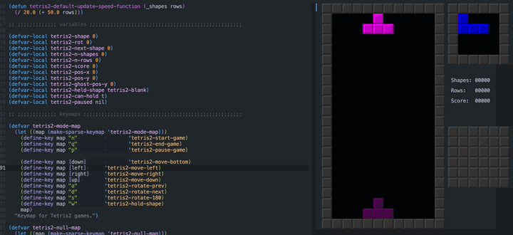

# etetris2

An update to tetris-mode, including:
- Hold piece
- Drop preview (ghost piece)
- I, S, and Z pieces that use the [Super Rotation System](https://tetris.wiki/Super_Rotation_System) instead of the [Original Rotation System](https://tetris.wiki/Original_Rotation_System)
- 1-key 180° rotate
- Updated colours: iconic pink T, etc.

It should play slightly more like tetrio or jstris. nintendo tetris purists may hate me!

todo: wall kicks, rotate should not interrupt continuous sideways motion, scoring
